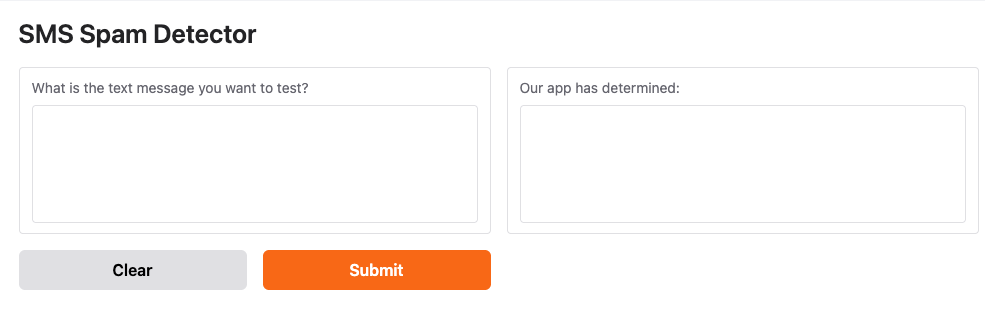

# SMS Spam Text Classification: Machine Learning Model

## Summary

This repository hosts a Jupyter Notebook showcasing a machine learning model designed to classify SMS messages as spam or not spam. The model uses `TfidfVectorizer` to convert text messages into numerical feature representations and a `LinearSVC` (Support Vector Machine) model for classification. The project includes a Gradio user interface for easy interaction.

### Key Features:
1. **SMS Message Input**: The Gradio UI provides an input box where users can submit an SMS message.
2. **Classification Output**: The UI displays whether the SMS message is classified as "spam" or "not spam" in an output box.

---

## SMS Spam Detector UI


---

## Setup

The Jupyter Notebook for this project is named `sms_text_classification.ipynb`. Ensure you have the required dependencies installed before proceeding.

### Requirements

1. Python v3.10 or later
2. Jupyter Notebook
3. Visual Studio Code or any other preferred IDE

---

## Installation Steps

1. **Create a new Conda environment for the project in the Terminal:**

   ```bash
   conda create -n llm python=3.10 anaconda -y
   conda activate llm
   pip install scikit-learn gradio
   ```

2. **Clone the repository:**
   ```bash
   git clone https://github.com/tlockhart/sms_spam_detector.git
   ```

3. **Open Visual Studio Code.** 
4. **Navigate to the project directory in the terminal:**
   ```bash
   cd sms_spam_detector
   ```
5. **Open the `gradio_sms_text_classification.ipynb` Jupyter Notebook.**  
6. **Run all cells in the notebook.**  
7. **If prompted for a kernel, select Python 3.10.4.1 and `llm`.**  
8. **Click the public Gradio link to open your web browser.**  
9. **Enter the sample SMS text into the Gradio UI and click 'Submit'.**  

---

## Running on Hugging Face Spaces  

To use the hosted version, visit:  
🔗 **[Hugging Face Space](https://huggingface.co/spaces/tlockhart/sms-spam-detector)**